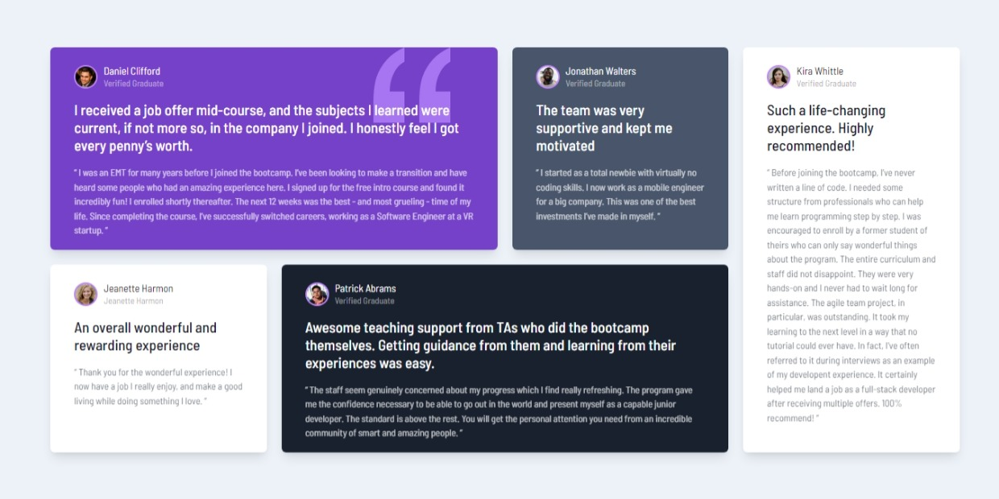

# Frontend Mentor - Testimonials grid section solution

This is a solution to the [Testimonials grid section challenge on Frontend Mentor](https://www.frontendmentor.io/challenges/testimonials-grid-section-Nnw6J7Un7). Frontend Mentor challenges help you improve your coding skills by building realistic projects. 

## Table of contents

- [Overview](#overview)
  - [The challenge](#the-challenge)
  - [Screenshot](#screenshot)
  - [Links](#links)
- [My process](#my-process)
  - [Built with](#built-with)
  - [What I learned](#what-i-learned)
  - [Continued development](#continued-development)
- [Author](#author)
- [Acknowledgments](#acknowledgments)

## Overview

### The challenge

Users should be able to:

- View the optimal layout for the site depending on their device's screen size

### Screenshot

### Links

- Solution URL: [solution](https://github.com/Thiagouh/testimonials-grid-section-challenge)
- Live Site URL: [live site](https://thiagouh.github.io/testimonials-grid-section-challenge/)

## My process

### Built with

- Semantic HTML5 markup
- CSS custom properties
- CSS Grid
- Mobile-first workflow
- [Tailwind CSS](https://tailwindcss.com/) - For styles

### What I learned

I developed my skills with Grid, better understanding its use.

### Continued development

I intend to continue using Grid display whenever necessary to improve my knowledge about it and increase the responsiveness of my projects

## Author

- Frontend Mentor - [@Thiagouh](https://www.frontendmentor.io/profile/Thiagouh)

## Acknowledgments

Thanks in advance for any future feedback
